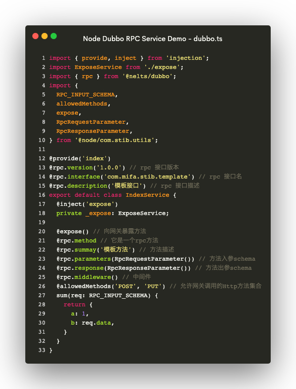

# @nelts/dubbo

service module using dubbo for nelts

# Usage

```bash
npm i @nelts/dubbo
```

## Preview



# License

[MIT](http://opensource.org/licenses/MIT)

Copyright (c) 2019-present, yunjie (Evio) shen
